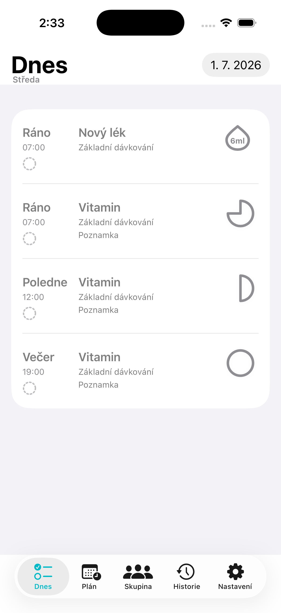
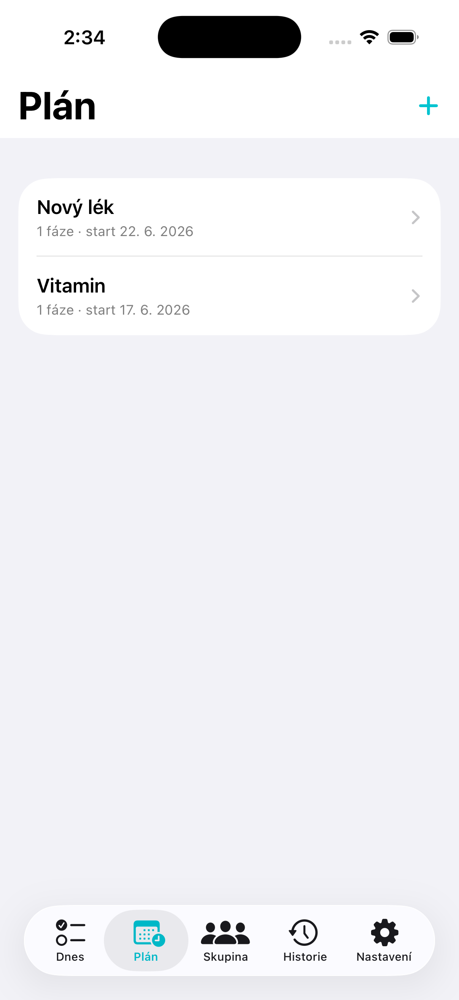
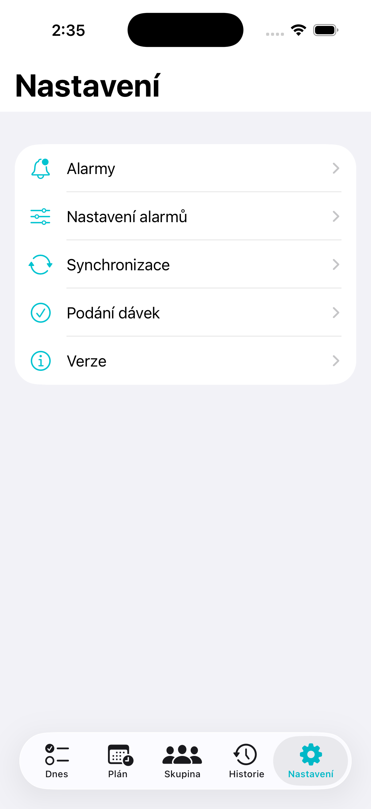

# Pill Care

Pill Care is a SwiftUI iPhone app for coordinating medication schedules and dose confirmations with family members or caregivers through iCloud and CloudKit.

The app is built around a simple rule: CloudKit is the source of truth. Dose confirmations, skipped doses, shared care groups, and shared medication plans are stored as CloudKit records and synchronized across devices instead of being treated as local-only state.

## Screenshots

<table>
  <tr>
    <td align="center"><strong>Today</strong></td>
    <td align="center"><strong>Plans</strong></td>
    <td align="center"><strong>Settings</strong></td>
  </tr>
  <tr>
    <td></td>
    <td></td>
    <td></td>
  </tr>
</table>

## Features

- Create private medication plans with multiple daily dose times and phased dosing.
- Track tablets and syrup doses with distinct dose controls and visual indicators.
- Confirm, skip, and undo dose confirmations from the Today screen.
- Share a care group through the system `UICloudSharingController`.
- Share individual medication plans into a group while keeping personal plans private.
- Preserve dose confirmation history when a plan is shared or removed from sharing.
- Synchronize private and shared CloudKit zones with incremental updates, full recovery paths, and foreground refresh safeguards.
- Schedule local notifications for upcoming and late-synced doses.

## Architecture

The app separates core business rules from platform infrastructure:

- `Packages/PillCore` contains pure domain models, scheduling logic, access rules, confirmation state handling, and unit tests.
- `PillsAlarm` contains the SwiftUI app, CloudKit repository, notification scheduling, and UI composition.
- `PillsAlarmTests` mirrors the important domain test coverage for the app target.

CloudKit sync uses zone change tokens for efficient incremental reloads. Authoritative full refreshes are still used for first launch, manual refresh, foreground recovery, token invalidation, and network recovery so that stale local projections do not become the source of truth.

## Requirements

- Xcode 16 or newer
- iOS 17 or newer
- Swift 6
- An Apple Developer account with CloudKit capability

## Apple Capabilities

The app expects the following iCloud container:

```text
iCloud.com.kolisko.pillcare
```

The iOS target must have these capabilities enabled:

- iCloud / CloudKit
- Push Notifications
- Background Modes / Remote notifications

Entitlements are defined in `PillsAlarm/PillsAlarm.entitlements`.

## Build And Test

Run the pure core test suite:

```bash
swift test --package-path Packages/PillCore
```

Run the iOS app tests from Xcode or with `xcodebuild`:

```bash
xcodebuild test \
  -project PillsAlarm.xcodeproj \
  -scheme PillsAlarm \
  -destination 'platform=iOS Simulator,name=iPhone 16,OS=latest'
```

## GitHub Automation

This repository uses GitHub Actions for:

- PillCore unit tests
- iOS simulator build/test coverage
- CodeQL analysis
- Dependabot updates for GitHub Actions and Swift Package Manager

## Status

Pill Care is under active development. The production CloudKit schema and App Store/TestFlight deployment are managed separately through Apple Developer and App Store Connect.
